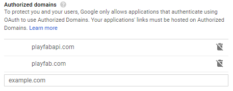
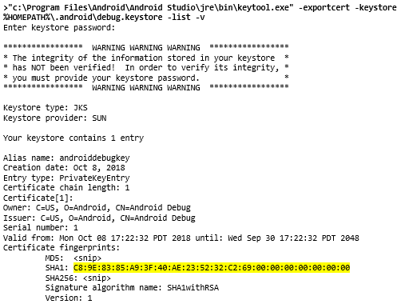
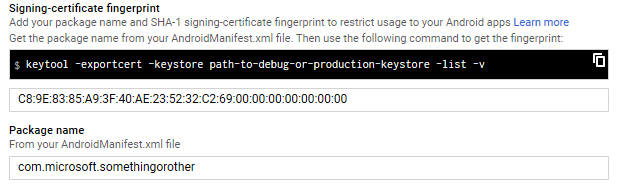
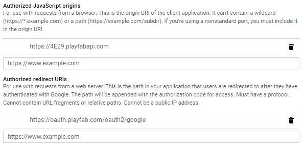
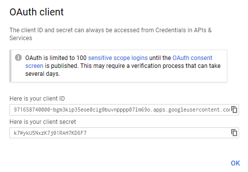
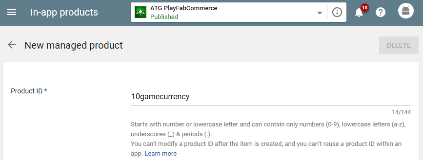
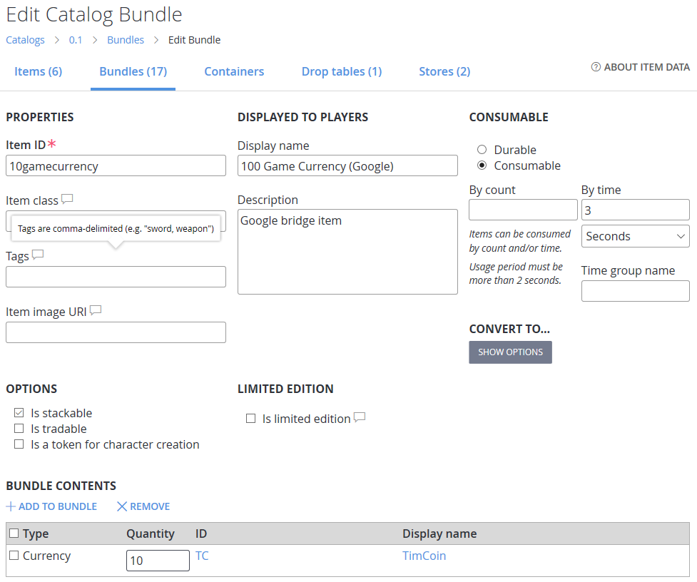
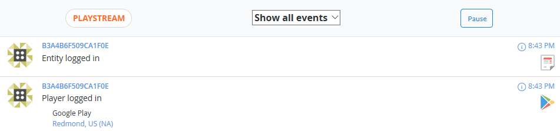
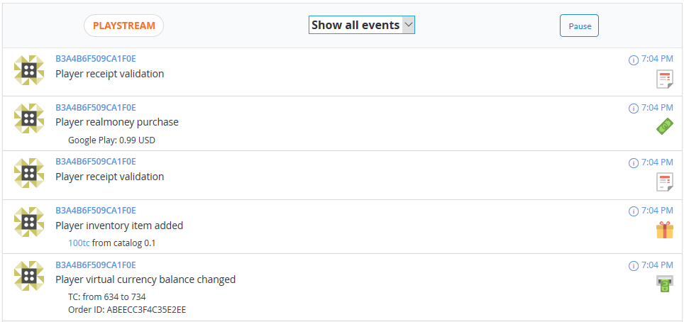

PlayFab Sign-in and validation of Google purchases in Android Studio
====================================================================

In this guide you will learn how to set up a basic Android app in
Android Studio that authenticates with a Google account and links with a
PlayFab login. This app will then offer real and virtual currency addons
in an in-game economy, using receipt validation to securely reconcile
real money purchases of virtual currency quantities.

Prerequisites 
--------------

* An app set up in Android Studio
* A Google developer account
* A PlayFab developer account with access to a game title
* Familiarity with the [Login Basics & Best
    Practices](https://api.playfab.com/docs/tutorials/landing-players/best-login) guide

Getting started
---------------

Much of the Google-specific configuration and options are documented
elsewhere. This guide will highlight the key steps and components
required to connect with a PlayFab title.

1. Create an application in the [Google Play Developer
    Console](https://play.google.com/apps/publish)
2. Create an app in Android Studio and enable billing permissions
3.  Build a signed .apk and upload to at least an Internal test track
4.  Configure OAuth client IDs in the [Google API developer
    console](https://console.developers.google.com/apis/credentials) to
    enable login
5.  Create a title in PlayFab and enable Google addon
6.  Create in-app products on Google Play Console
7.  Create items, bundles, and currencies in PlayFab Economy

### Create an application in the [Google Play Developer Console](https://play.google.com/apps/publish)

Just follow the steps, nothing specific is necessary here.

### Create an app in Android Studio and enable billing permissions

In AndroidManifest.xml:

1.  Set your unique and final package/application ID (e.g.
    com.publisher.app)
```
        <manifest xmlns:android="http://schemas.android.com/apk/res/android"
           package="com.microsoft.somethingorother">
```
2.  Add permission to enable Google in-app purchases
```
        <uses-permission android:name="com.android.vending.BILLING"/>
```
### Build a signed .apk and upload to at least an Internal test track

Signing will require creating a release build, see the following links

-   <https://developer.android.com/studio/publish/preparing#publishing-configure>
-   <https://developer.android.com/studio/publish/app-signing>

Successive versions will need versionCode incremented in
app/build.gradle, and they cannot overlap among the various tracks as
releases can be promoted upward through the tracks all the way to
production.

### Configure OAuth client IDs in the [Google API developer console](https://console.developers.google.com/apis/credentials) to enable login

OAuth 2.0 client IDs are needed for Google Sign-in as well as logging
into PlayFab with the Google identity.

1.  Create a new project.
2.  Credentials \> Create credentials \> OAuth client ID
3.  Configure OAuth consent screen if prompted
    * Add playfabapi.com and playfab.com to Authorized domains\
        
4.  Create OAuth for Google Sign-in with debug builds (e.g. debugging in
    Android Studio to AVD)
    1.  Create credentials \> OAuth client ID
    2.  Application type: Android
    3.  In order to allow debug build Google Sign in, obtain SHA-1
        signing certificate fingerprint from debug.keystore, e.g.
    
    4.  Enter this under Signing-certificate fingerprint
    
    5.  Note `%HOMEPATH%\.android` (or `\$HOME/.android` for Linux) is the
    default location for debug.keystore and this file (and therefore the
    fingerprint) is different per user/device. You may opt to use a
    different location that is checked into the repo for portability.
    See appendix for details
5.  Create OAuth for Google Sign-in with release builds (e.g. installed
    from Play Store)
    *  Same as above but with the SHA-1 obtained from the app signing
        key from Google Play Console \> Release Management \> App
        signing certificate (not the Upload certificate)
6.  Create OAuth for PlayFab login using Google identity
    (LoginWithGoogleAccount)
    1.  Create credentials \> OAuth client ID
    2.  Application type: Web application
    3. For Authorized JavaScript origins entire in the API endpoint for
        your PlayFab title, found in Game Manager under Settings \> API
        Features
    4. For Authorized redirect URIs, enter in
        https://oauth.playfab.com/oauth2.google
        
    5. Note the client ID and secret in this resulting screen that
        shows. This will be used when enabling Google addon in PlayFab
        Game Manager.\
        

### Create a title in PlayFab and enable Google addon

To enable logging in to PlayFab using a Google account (or Android
device ID) go to Add-ons in Game Manager

1.  **Google App Package ID**: package ID from AndroidManifest.xml
2.  **Google App License Key**: Google Play Console \> Development tools \>
    Services & APIs \> Licensing & in-app billing \> Your license key
    for this application (Base64-encoded RSA public key)
3.  **Google OAuth Client ID, Client secret**: from previous step for the
    Web application OAuth client ID
    

### Create in-app products on Google Play Console

The only thing that needs to be noted when creating the products is the
product ID. This is the identifier PlayFab uses to reconcile purchases.



Note that there is no way to designate a free price so by default your
published in-app products will invoke a real money purchase. More on how
allow testing without charges in the appendix.

### Create items, bundles, and currencies in PlayFab Economy

Create items, bundles, and currencies for your title as usual. For every
Google in-app product that you wish to reconcile with PlayFab backend, a
corresponding PlayFab bundle must be created with a matching product ID,
assigning to the bundle contents what you are offering when purchasing
the Google product. To illustrate the below figure shows the PlayFab
bundle that will grant the 10 game currency (TC) that the 10gamecurrency
product promises.

Note that the bundle is a time-based consumable set to expire after a
short amount of time. This is done so that the bundle purchase itself
doesn't show from GetUserInventory; its sole purpose is to map the
Google purchase to PlayFab items, so once the items have been granted,
there is no need to hold onto the bundle instance which is also granted.
If you're actually interested in the number of bundles purchased, then
set this to be a count-based consumable.

The actual granting of the PlayFab items corresponding to the real money
Google purchases is done with the ValidateGooglePlayPurchase API; more
details on this below.



Code integration
----------------

To recap, at this point you should have configured an Android Project,
built and uploaded an .apk to the Google Play Console, created OAuth
credentials to enable sign-in and purchase validation, enabled the
Google Addon for your PlayFab title, and finally created both Google and
PlayFab products.

A sample Android Project that has all the code required for interacting
with a product and title that was configured as above can be found at
https://github.com/PlayFab/PlayFab-Samples/tree/master/Samples/Android/PlayFabCommerce

This tutorial will not explain the code exhaustively but will go over
key PlayFab integration areas.

### Google and PlayFab sign-in

Create a sign-in client and either start the sign-in intent or assign to
a Google Sign-in button handler. `server_client_id` is the Client
ID for the Web client (not the Android ones) set up in Google APIs
console; this is the same one that was filled in when enabling PlayFab's
Google addon. `RC_SIGN_IN` is just a static constant that is used in
the activity handler.

```
    @Override
    protected void onCreate(Bundle savedInstanceState)
    {
    ...
        // https://developers.google.com/identity/sign-in/android/sign-in

        // Configure sign-in to request the user's ID, email address, and basic
        // profile. ID and basic profile are included in DEFAULT_SIGN_IN.

        GoogleSignInOptions gso = new GoogleSignInOptions.Builder(GoogleSignInOptions.DEFAULT_SIGN_IN)
                .requestScopes(new Scope(Scopes.PROFILE))
                .requestServerAuthCode(getString(R.string.server_client_id))
                .requestEmail()
                .build();

        // Build a GoogleSignInClient with the options specified by gso.
        mGoogleSignInClient = GoogleSignIn.getClient(this, gso);

        // Set the dimensions of the sign-in button.
        SignInButton signInButton = findViewById(R.id.sign_in_button);
        signInButton.setSize(SignInButton.SIZE_STANDARD);

        signInButton.setOnClickListener(new View.OnClickListener()
        {
            @Override
            public void onClick(View view)
            {
                Intent signInIntent = mGoogleSignInClient.getSignInIntent();
                startActivityForResult(signInIntent, RC_SIGN_IN);
            }
        });

    @Override
    public void onActivityResult(int requestCode, int resultCode, Intent data)
    {
    ...
        // Result returned from launching the Intent from GoogleSignInClient.getSignInIntent(...);
        if (requestCode == RC_SIGN_IN)
        {
            Task<GoogleSignInAccount> task = GoogleSignIn.getSignedInAccountFromIntent(data);
            try
            {
                GoogleSignInAccount account = task.getResult(ApiException.class);

                // Needed for LoginWithGoogleAccount
                String authCode = account.getServerAuthCode();

                SignInPlayFab(authCode);
            }
            catch (ApiException e)
            {
    ...
            }
        }
    }
```
At this point, you should be signed in with your Google account. If this
is the first sign-in after app installation, it should bring up a
permissions confirmation for the app where may need to select an account
if your device.

Note the authCode that is returned in the `GoogleSignInAccount`. This is
what `LoginWithGoogleAccountRequest` to know what Google identity is
communicating with PlayFab.
```
    // https://api.playfab.com/documentation/Client/method/LoginWithGoogleAccount
    PlayFabClientModels.LoginWithGoogleAccountRequest req = new PlayFabClientModels.LoginWithGoogleAccountRequest();

    req.TitleId = PlayFabSettings.TitleId;
    req.ServerAuthCode = authCode;
    req.CreateAccount = true;

    PlayFabErrors.PlayFabResult<PlayFabClientModels.LoginResult> result = PlayFabClientAPI.LoginWithGoogleAccount(req);
```
Once this API returns successfully the user will be signed into PlayFab
using the Google account. At this point you should be able see the
player logged on the PlayStream; note the Google Play icon.



Now other PlayFab API can be called, including `GetCatalogItems` and
`PurchaseItem` required to enumerate and purchase PlayFab items.

### Enumerate and Purchase Google in-app products

There are many samples and tutorials on how to do this on the web; the
sample referenced above uses the Play Billing library (as opposed to the
AIDL interface).

When the user successfully purchases an in-app product, the purchase
update handler will receive a response code of
`BillingClient.BillingResponse.OK`. This will be when to kick
off PlayFab's purchase validation.
```
    mBillingClient = BillingClient.newBuilder(activity).setListener(new PurchasesUpdatedListener()
    {
        @Override
        public void onPurchasesUpdated(int responseCode, @Nullable List<Purchase> purchases)
        {
            if (responseCode == BillingClient.BillingResponse.OK)
            {
    ...
```
Again, by default these purchases will charge real money from your
account's associated payment instrument. See the appendix to learn about
options to work around this.

Note that in contrast to some other platforms' addon offerings, Google
only has a single product type that is used to implement durable and
consumable behavior. To allow an owned product to be re-purchased, it
must first be consumed, otherwise it will act as a permanent durable and
thus be unpurchasable
(`BillingClient.BillingResponse.ITEM_ALREADY_OWNED`).
```
    // There is no distinction between durable and consumable in Google Play
    // A consumable is simply a purchase that has been consumed, so it can be purchased again
    // An unconsumed owned product will return ITEM_ALREADY_OWNED by launchBillingFlow
    ConsumeResponseListener listener = new ConsumeResponseListener()
    {
        @Override
        public void onConsumeResponse(@BillingClient.BillingResponse int responseCode, String outToken)
        {
            if (responseCode == BillingClient.BillingResponse.OK)
            {
    ...
            }
        }
    };
    
    mBillingClient.consumeAsync(purchase.getPurchaseToken(), listener);
```
Due to the nature of consumable transactions, it's highly recommended to
validate a purchase on the server and not on the client, and this is
where PlayFab comes in.

### Validate Google in-app product purchases with PlayFab

The point of doing everything in this tutorial culminates in this step.
`ValidateGooglePlayPurchase` is the client API where PlayFab will examine
key attributes of a Google purchase to validate that a purchase is
legitimate and grant the associated PlayFab items as defined in the
bundle.

Recall that there is a 1:1 correspondence between a Google in-app
product and a PlayFab bundle with a common identifier. When either the
purchase update handler or BillingClient.queryPurchases result contains
Purchase entries, these are unconsumed or permanently owned items that
the user owns. This is where the purchase fields are passed to
`ValidateGooglePlayPurchase` for validation.
```
    if (responseCode == BillingClient.BillingResponse.OK)
    {
        for (Purchase purchase : Objects.requireNonNull(purchases))
        {
            PlayFabClientModels.ValidateGooglePlayPurchaseRequest req = new PlayFabClientModels.ValidateGooglePlayPurchaseRequest();
    
            req.ReceiptJson = purchase.getOriginalJson();
            req.Signature = purchase.getSignature();
    
            SkuDetails detail = mSkuDetailsMap.get(purchase.getSku());
    
            // The price value will be added to the Value to date for the player.
            // This can be seen in the Player overview and also globally for the title in the PlayFab Dashboard
            // Note that by default the currencyCode does not affect anything, and the integer is assumed to be USD
            // Contact PlayFab devrel for enabling a conversion service that would do the proper conversion
            req.CurrencyCode = detail.getPriceCurrencyCode();
            req.PurchasePrice = detail.getPriceAmountMicros() / 10000;
    
            PlayFabErrors.PlayFabResult<PlayFabClientModels.ValidateGooglePlayPurchaseResult> result = PlayFabClientAPI.ValidateGooglePlayPurchase(req);
    
        }
```
In the above `mSkuDetailsMap` is a persistent map that contains
product details obtained by `querySkuDetailsAsync`. This is used to pass
in the current price information according to Google Play, which is used
by PlayFab to update a Value to date field for the player. Note the
caveat in the code comments above.

Purchase validation and resulting actions (changes to inventory items,
currencies, etc.) can be seen in the PlayStream:



Once successful validation is confirmed, and if the granted PlayFab
items are intended to be stackable consumables, then as mentioned
previously, the Google product should be consumed to allow additional
purchases. `BillingClient.queryPurchases` will always return owned and
unconsumed purchases, so anything returned here will not be purchasable
again until it is consumed.

Conclusion
----------

With this guide you should now have set up an Android Studio projects
and product configurations in both Google and PlayFab. You also know how
to set up in-app products from both platforms and how the purchase
validation flow works in order to set up a typical app economy
consisting of items purchasable with real money and virtual currencies.

For any further questions, please feel free to post to the [forums](https://community.playfab.com/index.html) or
contact xboxatgservices@gmail.com(subject: PlayFabCommerce) to get in touch with the tutorial author in the Advanced
Technology Group.

Appendix A: How to manage keystores
-----------------------------------

Google sign-in requires OAuth client IDs for Android set up in the
[Google API developer
console](https://console.developers.google.com/apis/credentials).
Sign-in is only allowed with a deployed package that matches the package
ID as well as a SHA-1 signing-certificate fingerprint configured for the
client ID.

For debug deployments (i.e. deployments to AVD or USB debugging device),
the debug.keystore is used, but by default, this is located in
%HOMEPATH%\\.android or \$HOME/.android and is specific to the user and
device. As such you would need to either:

-   Configure a separate client ID for each debug.keystore on each
    development device
-   Manually copy an authoritative debug.keystore to each device's
    .android directory
-   Persist debug.keystore in source control and have the build settings
    point to it

For the third option, assuming usage of gradle, the signingConfigs
section in the app's build.gradle is where you can override defaults:
```
    signingConfigs {
        debug {
            storeFile file("external/debug.keystore")
        }
        release {
            Properties properties = new Properties()
            properties.load(project.rootProject.file('local.properties').newDataInputStream())
            storeFile file(properties.getProperty('storeFile'))
            keyAlias properties.getProperty('keyAlias')
            storePassword properties.getProperty('storePassword')
            keyPassword properties.getProperty('keyPassword')
        }
    }
```
For debug, the shared debug.keystore is now located in an external/
directory relative to the build.gradle. Add this to source control and
now everywhere you clone the project will be able to deploy a debug
build that allows Google sign-in.

This is more complicated for release. You can build and deploy a release
build locally and you could configure that to use the debug.keystore,
but that will not work for builds that are installed from the Play Store
which are signed with an app signing certificate that is found on the
Google Play Console (if opted into Google Play app signing).

The signingConfig above for release looks for a local.properties file,
which is explicitly **not** to be checked into source control, as this
contains attributes for the release keystore that is used to
authentically sign the build for Play Store ingestion.

[Sign your
app](https://developer.android.com/studio/publish/app-signing) contains
more information on the Android APK signing process.

Appendix B: How to test Google in-app products
----------------------------------------------

By default, purchasing any in-app product, which must be assigned a
non-zero price, will require a valid payment instrument associated with
the Google account signed into the device. Once you confirm the
purchase, the payment method will be charged the price, just like any
other product purchase you make on the device.

To avoid this, try from these options:

-   [Implement a
    promotion](https://developer.android.com/google/play/billing/billing_onetime#Implement-promo):
    generate codes that expire up to a year after creation
-   [Add accounts to License
    Testing](https://developer.android.com/google/play/billing/billing_testing#testing-purchases):
    these testers accounts will be assigned a test payment instrument
    that can be used to make purchases for this app.
