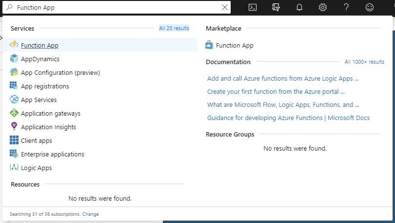
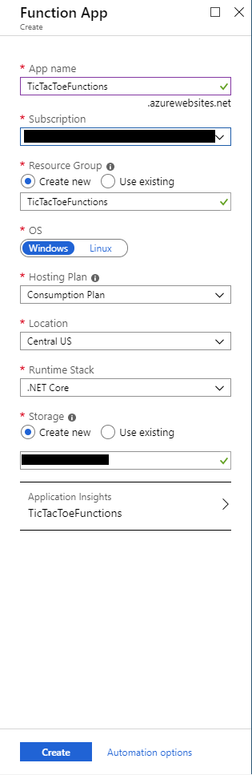
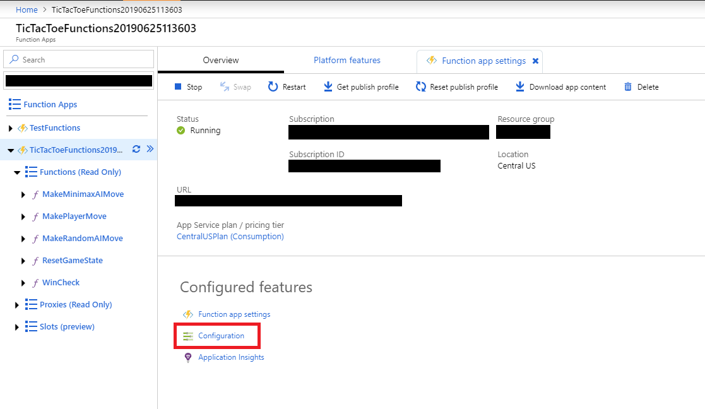
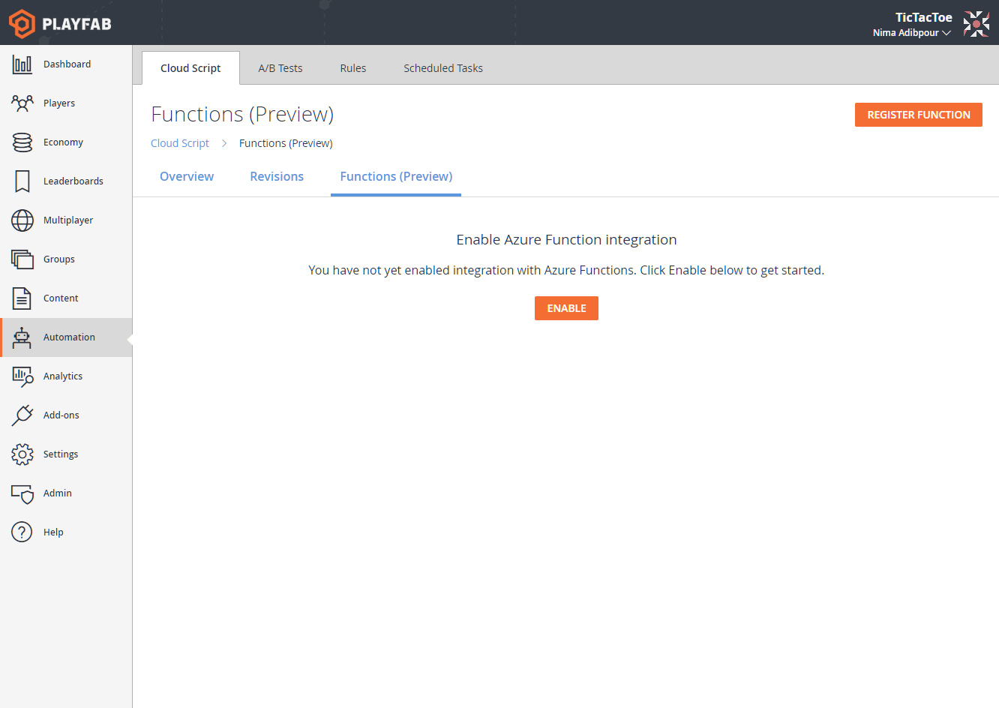
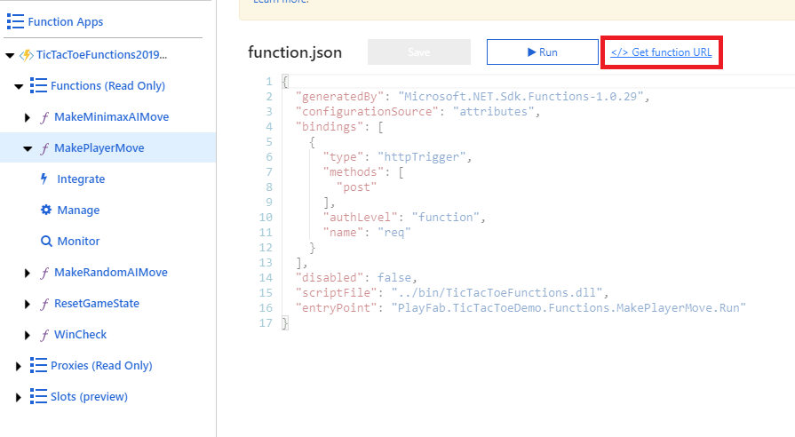
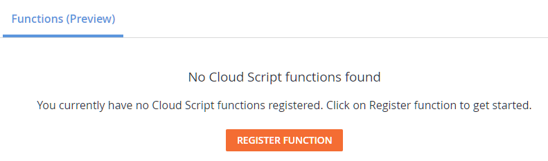
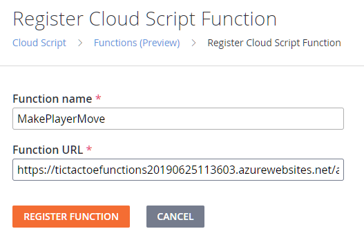

# Tic Tac Toe Azure Functions App (Unity Game)
The following repository contains the Azure Functions app supporting the sample Tic Tac Toe Unity game. This document acts as a guide on how this app was constructed and covers some critical concepts necessary to follow to integrate your Azure Functions with PlayFab.

## Pre-requirements
To get this Azure Functions app running you will need the following:
* [.NET Core 2+](https://dotnet.microsoft.com/download)
* [Azure Functions Core Tools](https://docs.microsoft.com/en-us/azure/azure-functions/functions-run-local#windows-npm)
* IDE ([VS Code](https://code.visualstudio.com/) or [Visual Studio](https://visualstudio.microsoft.com/) recommended)

If you wish to run this app on Azure you will need to bring your own subscription and deploy this app using the [Azure Portal](https://portal.azure.com), the [VS Code extension](https://code.visualstudio.com/tutorials/functions-extension/getting-started#_install-the-extension), the [Azure Functions and Web Jobs Tools](https://marketplace.visualstudio.com/items?itemName=VisualStudioWebandAzureTools.AzureFunctionsandWebJobsTools) for Visual Studio, or simply through the [CLI](https://github.com/Azure/azure-functions-core-tools).

## Project Dependencies
The `csproj` of this app has dependencies to the following NuGet packages
* [PlayFab C# SDK](https://www.nuget.org/packages/PlayFabAllSDK/) (for making PlayFab API calls)
* [PlayFab CloudScript C# Plugin](https://www.nuget.org/packages/PlayFabCloudScriptPlugin/) (for types and helper methods used to interprete the payload PlayFab sends to an Azure Function)

## Setup on Azure
Head over to the [Azure Portal](https://portal.azure.com) and search for "Function App".



#### New Azure Functions App
Click on "Add" and set up the app to suit your needs. More documentation on how to do this can be found [here](https://docs.microsoft.com/en-us/azure/azure-functions/functions-create-first-azure-function#create-a-function-app). You may need to create a new Subscription and Resource Group for your app.



#### Setting Application Settings
Once the app is created, head over to the Overview page and click on "Configuration". This is where you will be adding your PlayFab Title ID and PlayFab Developer Secret Key to the application settings so your functions can fetch them through the environment once deployed.



**It is important to assign your PlayFab Developer Secret Key and Title ID on these settings or else the Functions in this app will not work.** You may use other KMS mechanisms for other apps if you wish to do so.


#### Deploying Functions
You can now deploy the functions found in this repository to this app [through the VS Code Extension](https://code.visualstudio.com/tutorials/functions-extension/deploy-app) or [other methods not discussed here](https://docs.microsoft.com/en-us/azure/azure-functions/functions-develop-vs#publish-to-azure).
Please note that you will need to re-deploy your app every time you want to see changes made to the app locally get reflected in your remote deployment.

## Setup on PlayFab
The setup process on PlayFab is explained in both this repository and the [Tic Tac Toe Unity Game repository](https://github.com/PlayFab/PlayFab-Samples/tree/master/Samples/Unity/TicTacToe). This setup however must only be done once.

#### Create a New PlayFab Title
Create a new PlayFab Title and call it TicTacToe. More instructions on how to do this can be found [here](https://docs.microsoft.com/en-us/gaming/playfab/personas/pfab-account). Take note of the **Title ID** and **Developer Secret Key** of your new title as you'll need to enter them in both the game (Title ID only) and the Azure Functions app (Title ID and Developer Secret Key as mentioned above).


#### Enable Azure Functions Integration
Head over to the `Automation/Cloud Script/Functions` page in Game Manager to enable the integration.



#### Register Your First Azure Function with PlayFab
You must first grab the invokable URL of your Azure Function from the Azure Portal or VS code extension.
To do that, simply click on the function in the portal, and click on "Get function URL". **Make sure under "Key" it says "default (Function key)"**.



The URL of your function will usually be in the format of `[function app name].azurewebsites.net/api/[function name]`.


From there copy the URL and head back over to the PlayFab `Automation/Cloud Script/Functions` page.
Click on the "Register Function" button either on the header or the middle of the page.



On the next page that opens you can enter your function name (**an important note on this will follow later**) and the URL you just copied and click register.



Once registered, you may then view, delete, edit your function registrations through the previous page.

Note that only the URL of a registration may be editted after registration, the name cannot be changed.

The setup process is now complete and you can proceed to deploy and register all functions provided under the `/Functions` folder in this repository so that the game may call them once run.

## An Important Note on Function Registration URL
While registering a function you have the freedom to insert a URL pointing to any function and give it any name, not necessarily the function's actual name. For example, you may register the URL of `MakeMinimaxAIMove` and name it anything else you want on PlayFab, like `MakeAIMove`. Whatever name you register it with, however, must be the name your game client uses to call the function in the `ExecuteFunctionRequest`. This allows you to change the URL of a currently registered function with PlayFab to point to another function on the fly, thus changing back-end logic without having to change the name of the function your game calls and rebuilding it.

For example, in this app's `MakeAIMove.cs` file there are two functions: `MakeRandomAIMove` and `MakeMinimaxAIMove`. These are different variants of the same functionality and we only need one of these to respond to our game at a time. Hence the registration is made under the name `MakeAIMove` on PlayFab and the game is coded to request the execution of `MakeAIMove` as well.

While running the app locally, however, the URLs of your functions will strictly match their names. For example, by default, `MakeMinimaxAIMove` would be hosted at `http://localhost:7071/api/MakeMinimaxAIMove`. Due to this, you must be careful when attempting to execute your functions from the game with names other than what they are actually called.

For example in this case when running locally we would either have to change the function name in the game client to be one of `MakeRandomAIMove` or `MakeMinimaxAIMove` and not `MakeAIMove`, or rename one of these two functions to `MakeAIMove`, as there is no local URL lookup to map `MakeAIMove` to either of the local URLs of these functions.

## Local Debugging
To run your Azure Functions locally, all you have to do is create a run-configuration (which is done automatically by VS Code and Visual Studio once you open an Azure Functions App), and hit `F5` in the IDE. This will start up a new Azure Functions run-time locally, and host your functions by default on `http://localhost:7071/api/[function name]`.

To "enable" local debugging and redirect the `ExecuteFunction` calls in your game client to not send requests to PlayFab and instead send them locally there are a few steps to follow:

1) Download and insert an Azure Function called `ExecuteFunction` [found here]() into the same folder you decide to keep the rest of your functions in your Azure Functions app. In this case it would be `/Functions`.
    * You should not make modifications to this Azure Function.
    * You should not deploy this Azure Function to your app on Azure, it's only useful when run locally.
    * It is adviced to not check-in this Azure Function to a VCS.
    * This function is called by your game client's PlayFab SDK code when local debugging is "enabled" on it.
    * It acts as a local mock of the PlayFab server for executing Azure Functions locally by creating the same payload PlayFab would send to an Azure Function in the remote case.
        * In short, your game client's SDK will send the execution request to this function, which then creates the appropriate payload to send to your Azure Function.
2) Create and insert a new file called `playfab.local.settings.json` in the **game client root directory** OR in **your user's TEMP directory in the operating system**.
    * The contents of this file should be:
    ```
    {
        "LocalApiServer": "http://localhost:7071/api/"
    }
    ```
    * The value of `LocalApiServer` must match the URL your function app is being hosted on. By default, the Azure Functions run-time sets this to `http://localhost:7071/api/` and hence [unless you change it manually](https://docs.microsoft.com/en-us/azure/azure-functions/functions-host-json#http) in the app's `host.json` file, the above file contents will work.
    * If you do want to change the route prefix to be something other than `/api/`, the app's `host.json` file will look like:
    ```
    {
        "version": "2.0",
        "extensions": {
            "http": {
                "routePrefix": "foo"
            }
        }
    }
    ```
    and the `playfab.local.settings.json` file must be updated accordingly. **It is important that you end the `LocalApiServer` string with a forward slash `/`**.
    * Unless absolutely necessary we suggest taking the default values of both the `routePrefix` and `port` ([how to change the port](https://docs.microsoft.com/en-us/azure/azure-functions/functions-run-local#local-settings-file)).
    * (Note that the following step will be done automatically through the PlayFab VS Code extension once it is released)

## PlayFab API Calls from Azure Functions
A good example for where this is useful is stat updates and player data. Let's take the `MakePlayerMove` Azure Function in this app as an example. At it's core, this function takes the coordinates of a move a player wants to make on a 3x3 Tic Tac Toe board, loads the state of that player's board from [PlayFab's Player Data](https://docs.microsoft.com/en-us/gaming/playfab/features/data/playerdata/quickstart) validates that the move requested can be made, and changes the state of the coordinates specified in the request to indicate the player placed a token there.

However, to be able to make PlayFab API calls, you need to specify several key settings on the SDK such as `TitleId` and `Developer Secret Key` (where applicable). A suggested storage mechanism for these credentials and fields is the application settings of the app. In the local case, you'd place these as key value pairs in the [`local.settings.json`](https://docs.microsoft.com/en-us/azure/azure-functions/functions-run-local#local-settings-file) file located at the root of your app, and remotely, you'd either upload your local settings through the Azure Functions IDE extension or set them in the portal in [Application Settings](https://docs.microsoft.com/en-us/azure/azure-functions/functions-how-to-use-azure-function-app-settings#settings). Once set, the values can be retrieved using
```
PlayFabSettings.TitleId = Environment.GetEnvironmentVariable(TITLE_ID_KEY, EnvironmentVariableTarget.Process);
```
where `TITLE_ID_KEY: string` corresponds to the key assigned to the field in `local.settings.json` or the remote Application Settings on Azure.

## Models
Although it's possible to program Azure Functions with `dynamic`s and not have strict type definitions for what goes in and out of a function, it is highly recommended to structure your models into request and response models as seen here. It improves performance and makes the process of tracking down technical bugs with your functions a lot easier and simpler.
Examples of such models in this project include `MakePlayerMoveRequest`, `MakePlayerMoveResult`, `PlayFabIdRequest`, and others.

## Functions
This app comes with various pre-made functions that the Tic Tac Toe sample game depends on. These include `MakeRandomAIMove`, `MakeMinimaxAIMove`, `MakePlayerMove`, `ResetGameState`, and `WinCheck`.

`MakeMinimaxAIMove` and `MakeRandomAIMove` are alternative algorithms that solve the same problem: getting the next AI move in Tic Tac Toe, however having both of them deployed to the Azure Functions App allows us to swap the back-end logic of the game by changing the URL of the registration on PlayFab to point to one of these two functions, as explained more [here](#an-important-note-on-function-registration-url).

## The PlayFab Cloud Script Plugin
This plugin is recommended to be added to all Azure Functions apps meant to be used with PlayFab. It provides factory methods that create the context object representing the payload coming into an Azure Function from PlayFab, as well as API settings and authentication objects that you can use to create PlayFab instance API clients in an Azure Function. Once integrated with the project, the plugin can be used to create a context object as the first line of every Azure Function you write to be used with your game on PlayFab:
```
namespace PlayFab.Demo {
    public static class Foo {
        public static async Task SomeFunction(
        [HttpTrigger(AuthorizationLevel.Function, "post", Route = null)]
        HttpRequestMessage req, ILogger log)
        {
            var context = await FunctionContext<T>.Create(req);
        }
    }
}
```
The `context` object in the above example has a `FunctionArgument: T` field on it, which is the function's parameters passed in the `ExecuteFunction` call on the client, as well as other fields including the `CallerEntityProfile: EntityProfileBody` and the current player's Id.

In summary, this plugin helps as a form of convenience to take the payload PlayFab provides to an Azure Function and deserialize it into an object, creating a variety of fields that can be used in the context of an Azure Function.

## Instance APIs
We strongly recommend using PlayFab Instance APIs over the static ones in Azure Functions. Because of this, we provide a `PlayFabAPISettings` and `PlayFabAuthenticationContext` in the [`FunctionContext` object](#the-playfab-cloud-script-plugin) to be passed to your Instance APIs upon construction. Note that you must set the secret key on the context's `PlayFabAPISettings` yourself as it is not part of the payload delivered to your Azure Function.

Due to the ability to call the same Azure Function from various contexts and titles, if you use static APIs, there is a very high chance that the settings you set on the APIs are overriden at run-time by different instances of the functions running in parallel, causing unexpected race-conditioned behavior. Creating an instance of an API client in a function will avoid this and make the functions of an app in isolation.