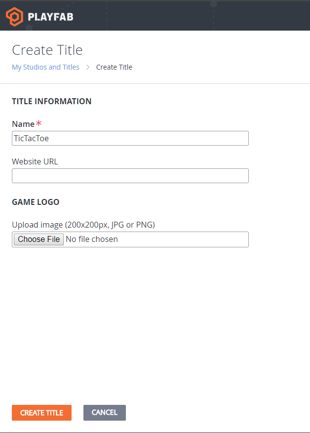
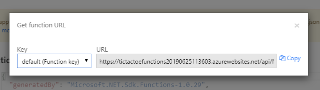

# Tic Tac Toe Unity Game
The following repository contains the source code for the Tic Tac Toe Unity Game released as sample code utilizing PlayFab's Cloud Script Azure Functions integration.

## Pre-requirements
* [Unity 2019.1.8.f1](https://unity.com/)

### Project Dependencies
* [PlayFab Unity Beta SDK](https://github.com/PlayFab/UnityBeta) (included with source code but not regularly updated)
* [MK Glow Free Unity Marketplace Plugin](https://assetstore.unity.com/packages/vfx/shaders/fullscreen-camera-effects/mk-glow-free-28044) (free to use third party shader plugin for some visual effects)

To get this game running you need to setup the Azure Functions App provided for it [here](https://github.com/PlayFab/PlayFab-Samples/tree/master/Samples/CSharp/AzureFunctions/TicTacToeFunctions).

## Setup on PlayFab

The setup process on PlayFab is explained in both this repository and the [Tic Tac Toe Functions repository](https://github.com/PlayFab/PlayFab-Samples/tree/master/Samples/CSharp/AzureFunctions/TicTacToeFunctions). This setup however must only be done once.

#### Create a New PlayFab Title
Create a new PlayFab Title and call it TicTacToe. More instructions on how to do this can be found [here](https://docs.microsoft.com/en-us/gaming/playfab/personas/pfab-account). Take note of the **Title ID** as you will need to enter it in the game's API clients. You can set this in `/Assets/Scripts/Constants.cs`

#### Enable Azure Functions Integration
Head over to the `Automation/Cloud Script/Functions` page in Game Manager to enable the integration.

#### Register Your First Azure Function with PlayFab
You must first grab the invokable URL of your Azure Function from the Azure Portal or VS code extension.
To do that, simply click on the function in the portal, and click on "Get function URL". **Make sure under "Key" it says "default (Function key)"**.

The URL of your function will usually be in the format of `[function app name].azurewebsites.net/api/[function name]`.

From there copy the URL and head back over to the PlayFab `Automation/Cloud Script/Functions` page.
Click on the "Register Function" button either on the header or the middle of the page.

On the next page that opens you can enter your function name and the URL you just copied and click register.

Once registered, you may then view, delete, edit your function registrations through the previous page.

Note that only the URL of a registration may be editted after registration, the name cannot be changed.

The setup process is now complete and you can proceed to deploy and register all functions provided under the `/Functions` folder in this repository so that the game may call them once run.

## Setup in Unity Game Code

You must set `Constants#TitleID` to be the Title ID associated with the Title you created on PlayFab for this game.

#### Adding the PlayFab Unity Beta SDK

The game utilizes the PlayFab Unity SDK extensively and as the features showcased in these samples are still in Beta you will need to use the [Beta SDKs found here](https://github.com/PlayFab/UnityBeta).
To add the SDK to the game, simply drag and drop the `PlayFabSDK` folder (found in the repository's `Source` folder ) into the game's `Assets` folder.

It is recommended to drag the folder into the [Unity Project View](https://docs.unity3d.com/Manual/ProjectView.html) rather than performing this copy operation in your operating system's folder browser. Unity will automatically recompile and create the associated `.meta` files for the SDK if you drop the folder in the Project View.

## Structure

The game board is located in the `Main.unity` scene.

The game's code is split between `/Handlers`, `/Models`, `Board.cs`, `Game.cs`, and `Settings.cs`. The entry point starts with `Game.cs` where once a player is logged in, the game loop is started to run until the game instance is over, and can be restarted.

The `Board` is a `MonoBehavior`assigned to the physical board object in the game scene that holds three `TokenRow`s, each of which contain three `TokenPlaceholders` representing the spots an X or O may be placed in a Tic Tac Toe game.

Within `/Handlers` you will find a series of request handlers that utilize the PlayFab Unity SDK to make API calls. These request handlers have been implemented using [Unity's Coroutines](https://docs.unity3d.com/Manual/Coroutines.html) to avoid using callbacks in most cases and have flat easy-to-understand async code.

Within `/Models` you will find a series of data-structures that the game uses to record concepts like a `TicTacToeMove` and `GameWinnerType`, as well as some request and response types for clean serialization and deserialization of requests and responses to and from Azure Functions that handle the state change and back-end logic of this game.

**Note** that as practiced here, it is important for your types shared among your game client and Azure Functions to match.

Although Azure Functions are able to receive fields in the payload with their names either capitalized or not, using the default serializer they will always respond with lower-cased field names. This can cause serialization issues and so your models must be constructed with this in mind. You will see an example of this in `TicTacToeMove` where both fields (`row` and `col`) are lower-cased as the type is the response type of `MakeRandomAIMove` and `MakeMinimaxAIMove` functions in the [Azure Functions App](https://github.com/PlayFab/PlayFab-Samples/tree/master/Samples/CSharp/AzureFunctions/TicTacToeFunctions).

## Game Flow

Once the player is logged in, the loop of the game works as follows:
1. Let the player make a move
    1.1. Execute the player move function and submit the move to it
    1.2. If the server responds that the move was valid place the token and continue
    1.3. Otherwise repeat from 1
2. Execute the win checker function to see if the player's move resulted in them winning
    2.1. If so game is over
    2.2. If not continue
3. Execute the AI move generator function
    3.1. If the AI was able to make a move place the token and continue
    3.2. Otherwise AI had no space to make a move so skip its turn
4. Execute the win checker function to see if the AI's move resulted in it winning or the game was a draw since AI might not have been able to make a move
5. Repeat from 1